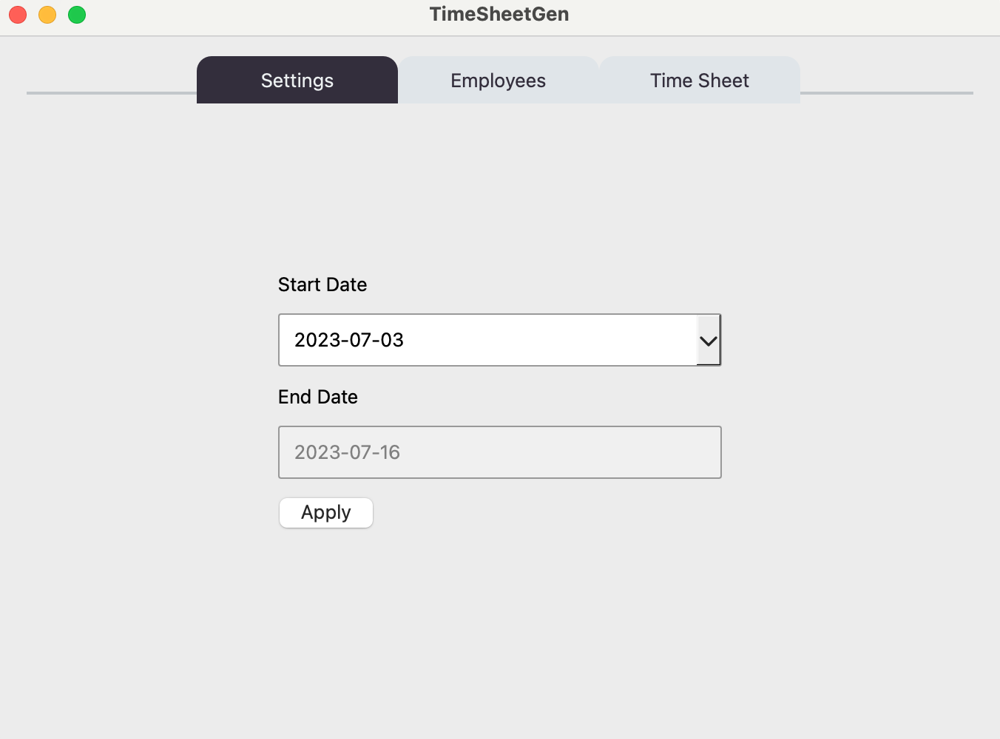
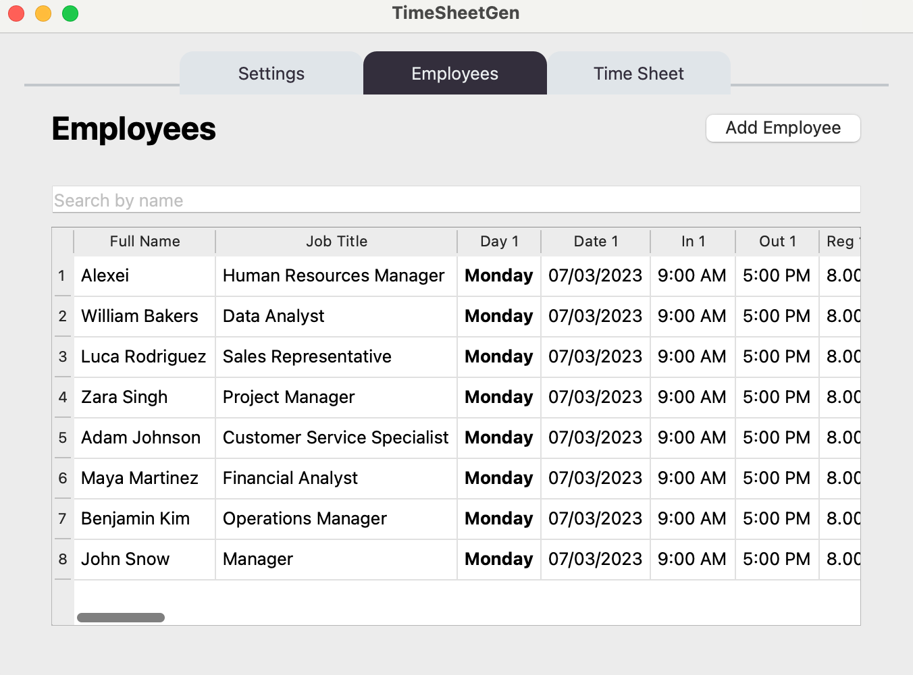
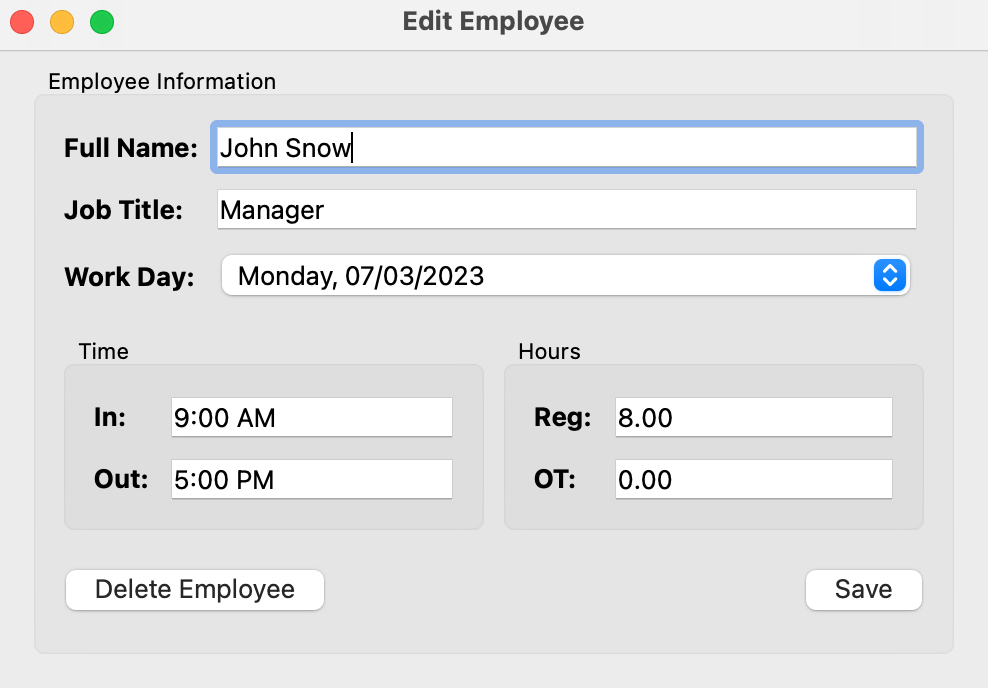

# Time Sheet Generator

A tool for logging employee hours and generating time sheets.

## Supported features

- Setting the start date for a new pay period. Applying a new date will dynamically update the values in the table. 
- View all employees and corresponding time sheet information in a table format. 
- Search for an employee by name.
- Edit employee details. 
- Delete an employee. A warning message will pop up to confirm.
- Add an employee.

## Notable screens

Please note the database included in this project contains fake data generated solely for the purpose of demonstration.

### Settings tab

Set the start date for the pay period here.

### Employees tab

View the data here. Search for a specific employee using the search bar. Add a new employee via the 'Add Employee' button. Edit an employee by clicking their entry in the table.

### 'Edit Employee' window

Appears when an entry of the table is clicked. Can edit any of the fields here. To change to a different work day, select the date via the dropdown menu. The option to delete an employee is also present.

