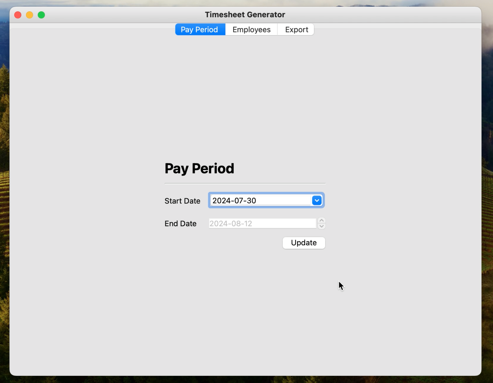
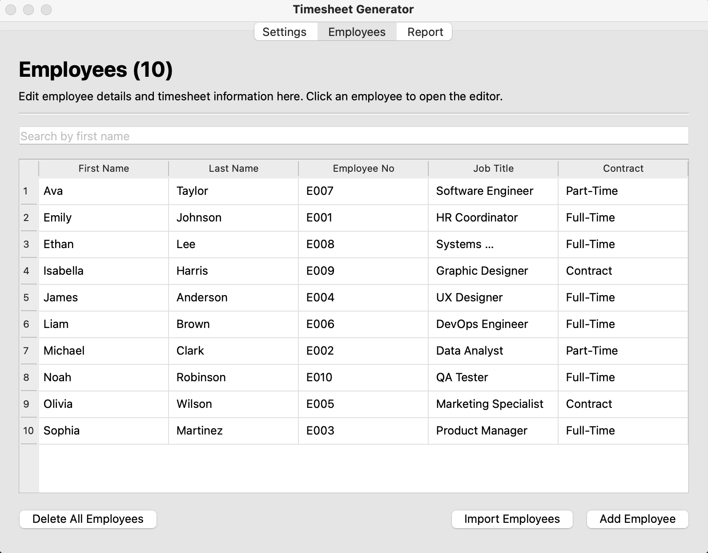
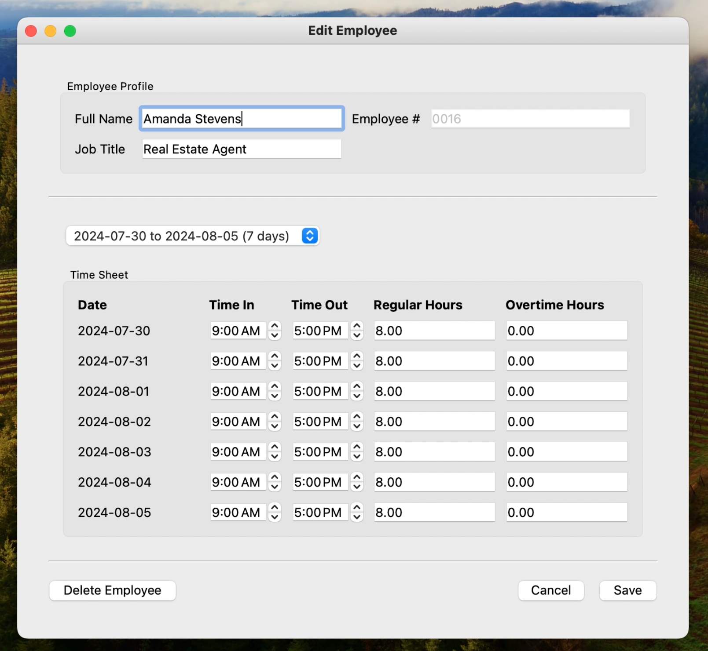

# Time Sheet Generator

A tool for logging employee hours and generating time sheet reports.

## Supported features

- Setting the start date for a new pay period. Applying a new date will dynamically update the values in the table. 
- View all employees in a table format. 
- Search for an employee by name.
- Edit employee details. 
- Delete an employee. A warning message will pop up to confirm.
- Add an employee.
- Import employees from a .csv file.

## Notable screens

Please note the database included in this project contains fake data generated solely for the purpose of demonstration.

### Pay Period tab

Set the start date for the pay period here.

### Employees tab

View the data here. Search for a specific employee using the search bar. Add a new employee via the 'Add Employee' button. Add many employees via the 'Import CSV' button. Edit an employee by clicking their entry in the table.

### 'Edit Employee' window

Appears when an entry of the table is clicked. Can edit any of the fields here. To view another range of work days, select it via the dropdown menu.

### 'Import Employees' window

Import many employees at once by uploading a .csv file.

