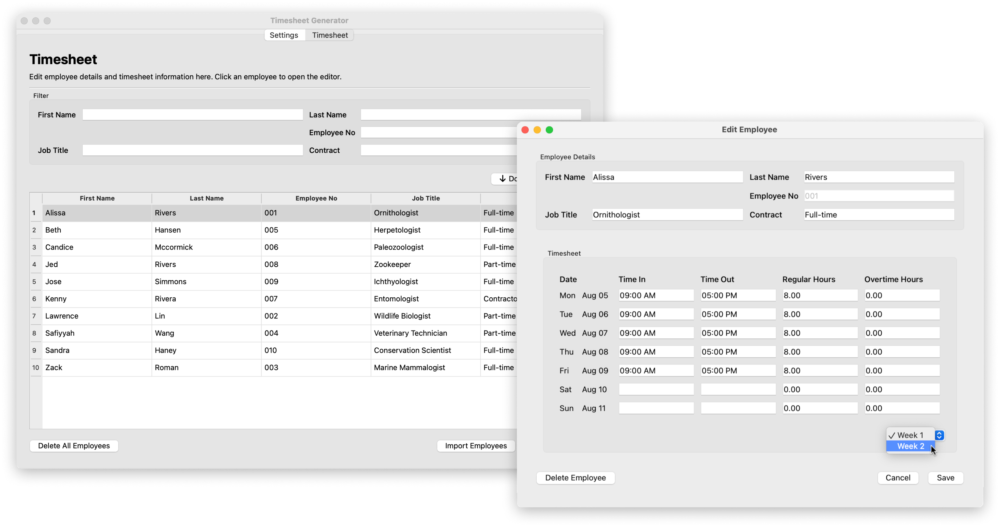
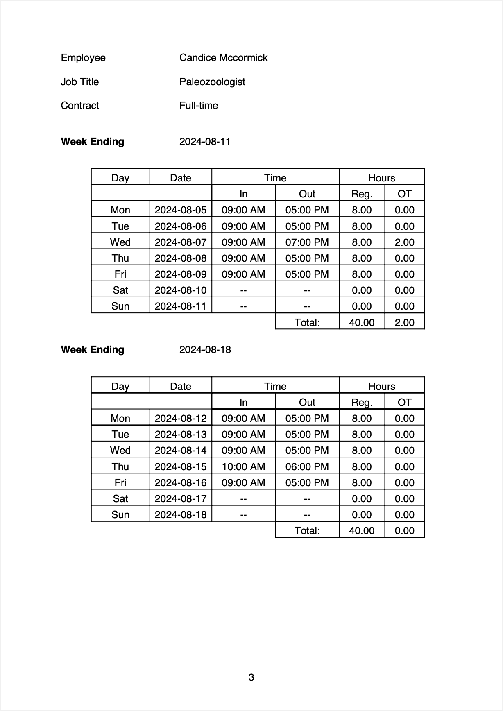
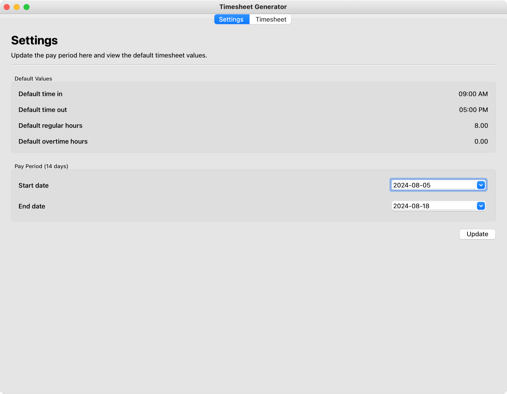
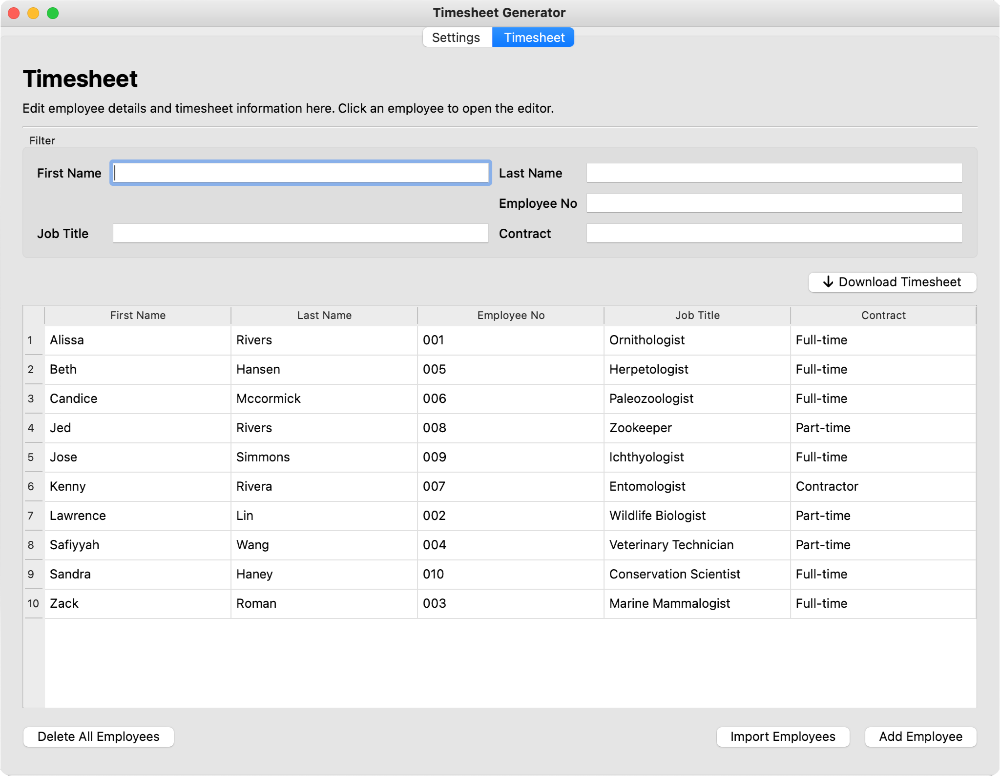
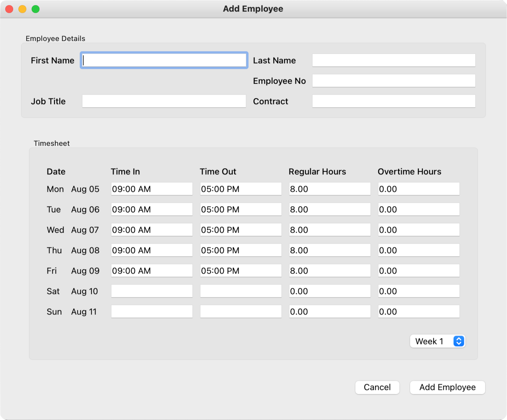
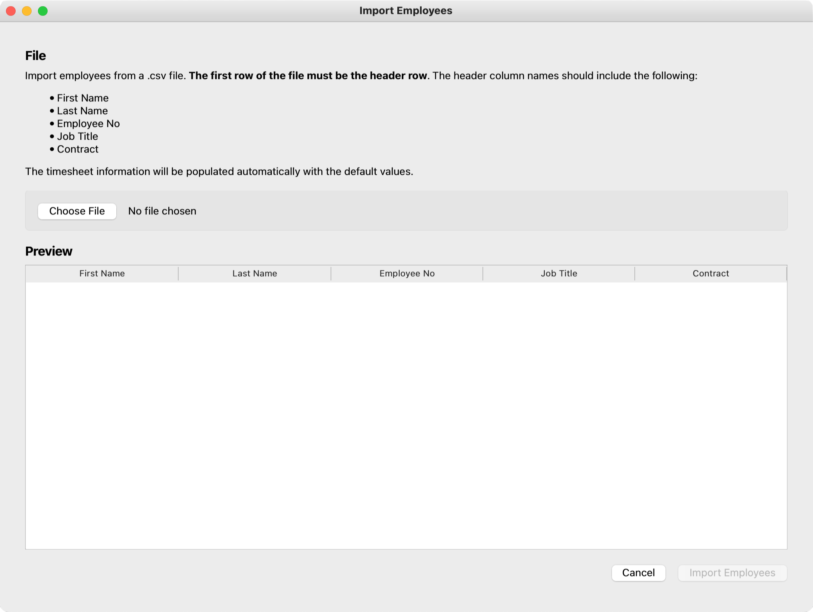

# Timesheet Generator

A Windows and macOS desktop application for logging employee hours and generating PDF timesheet reports.

## Features

- <b>Automatic population:</b>  Automatically fills in timesheet information with the configured settings
- <b>Expressive filter:</b> Search and filter employees using a combination of employee details
- <b>Quick setup:</b> Add multiple employees at once by uploading a CSV file
- <b>Flexible reports:</b> Generate timesheet reports for employees that match a filter
- <b>Simple storage:</b> All app data is stored locally in a SQLite database

## A Closer Look

### The Report

Page 3 of a generated PDF timesheet report. There is one employee per page in the full report.

### Settings Tab

<b>Settings Tab.</b> Update the pay period and view the default timesheet values.

### Timesheet Tab

<b>Timesheet Tab.</b> View employees in a tablular format and download timesheet reports.

### Add Employee Window

<b>Add Employee Window.</b> Similar to the <b>Edit Employee Window</b> for editing employee details, as shown in the first image. Add a new employee with default values initialized.

### Import Employee Window

<b>Import Employees Window.</b> Upload employees from a CSV file and view them in the preview table before importing.

## Acknowledgements

App icon designed by Freepik.
