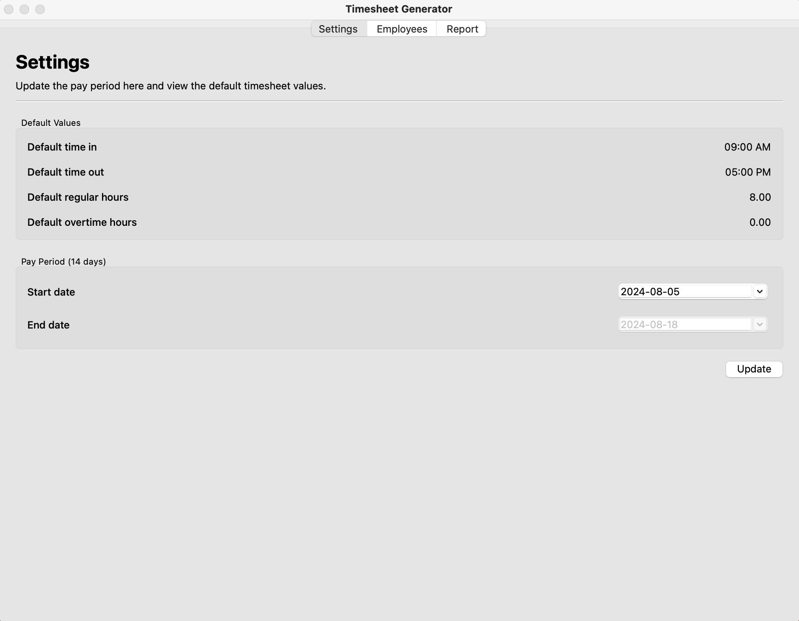
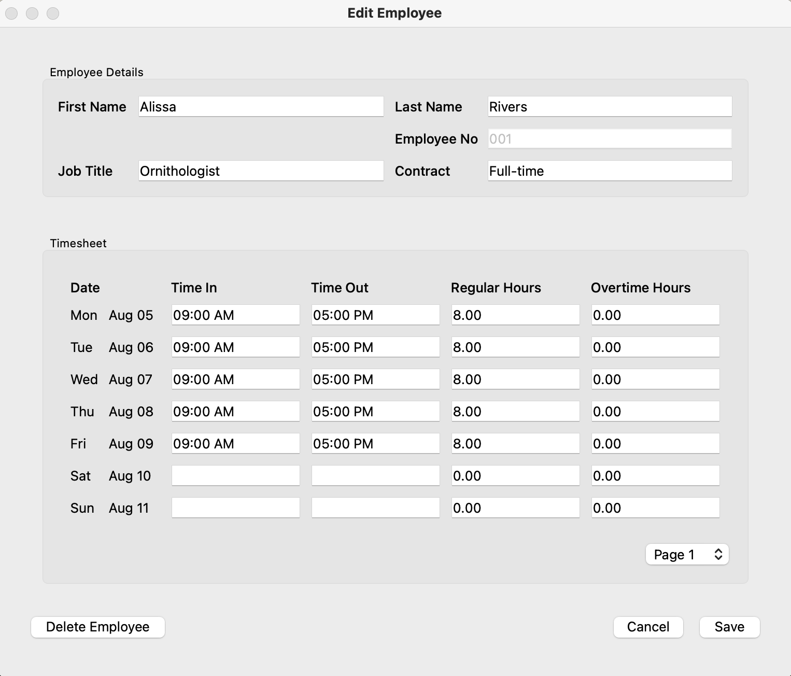
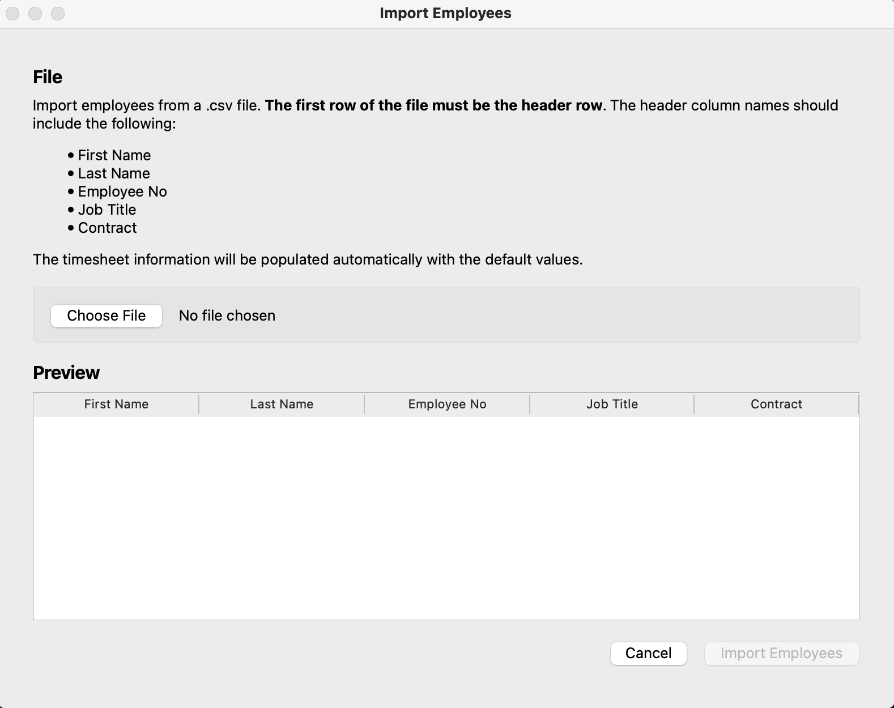

# Timesheet Generator

A tool for logging employee hours and generating PDF timesheet reports. (Features are developed as requested by client.)

## Supported Features

- Update the pay period. This will delete all the current employee data.
- View all employees in a table format. 
- Search for an employee by name.
- Edit employee details and timesheet information.
- Delete an employee.
- Delete all employees.
- Add an employee.
- Import employees from a .csv file.

## What's Left

- `Report` Tab for generating and outputting the timesheet PDF.

## Screens

Employee details shown here are AI-generated.

### `Settings` Tab

Update the pay period here and view the default timesheet values.

### `Employees` Tab

Edit employee details and timesheet information here. Click an employee to open the editor.

### `Edit Employee` Window

### `Import Employees` Window

Import employees from a .csv file.

